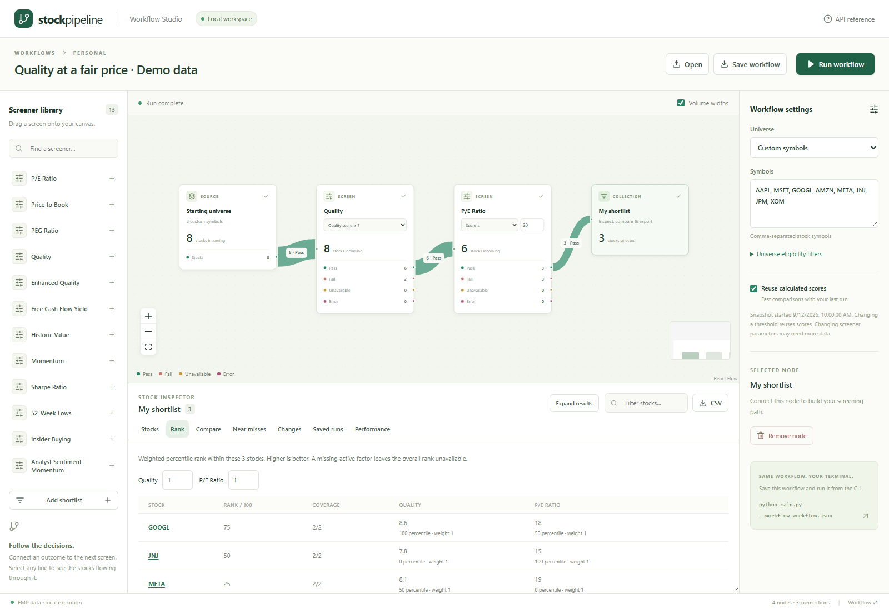

# Stock Pipeline

A local stock-screening and research workspace built with Python and React. Create a visual screening workflow, follow each stock's decisions, compare the shortlist, and run the same workflow from the command line.



*Workflow Studio with illustrative demo data, not live market results.*

## What you can do

- **Build screening paths:** connect Pass, Fail, Unavailable and Error outcomes; inspect stocks at each step and export CSV.
- **Understand each stock:** see its screening path, recorded values, applied thresholds, decision reasons and sector-sample comparisons.
- **Research a shortlist:** adjust ranking weights, compare 2–5 stocks, inspect near misses, and load up to five annual financial reporting periods.
- **Follow changes:** restore completed runs and compare entrants, departures and updated decisions.
- **Track forward performance:** compare a saved shortlist's subsequent price returns with a benchmark you choose.
- **Control the universe:** use custom symbols, S&P 500, Nasdaq 100 or Russell 2000 in the editor, with optional exchange, market-cap and average-volume filters.

Rankings describe the selected sample; they do not predict returns. Missing data remains visible.

## Quick start

You need Python (3.12 is the documented setup), Node.js with npm, and a Financial Modeling Prep API key. Data availability depends on your FMP access and the endpoints each screener uses.

### 1. Install

From the repository root on Windows:

```powershell
py -3.12 -m venv .venv-ui
.venv-ui\Scripts\python.exe -m pip install -r requirements.txt
.venv-ui\Scripts\python.exe -m pip install -r requirements-ui.txt
cd web
npm ci
npm run build
cd ..
```

Install the Python requirements files separately in that order: the editor requirements upgrade the shared typing dependency. On macOS or Linux, create the environment with `python3 -m venv .venv-ui` and use `.venv-ui/bin/python` in place of the Windows Python path.

### 2. Configure FMP

Create `.env` in the repository root:

```dotenv
FINANCIAL_MODELING_PREP_API_KEY=your_key_here
```

`.env`, cached data, generated outputs and saved-run history are excluded from Git. Screening defaults and provider settings live in [`config.py`](config.py).

### 3. Start the editor

```powershell
.\scripts\start_visual_editor.ps1
```

Open **http://127.0.0.1:8765**. Keep the terminal running; `Ctrl+C` stops the server. The API reference is at http://127.0.0.1:8765/docs.

Alternatively, start the API directly with `.venv-ui\Scripts\python.exe visual_api.py` (use `.venv-ui/bin/python visual_api.py` on macOS/Linux). The server listens only on the local computer and executes one workflow at a time.

## Using Workflow Studio

1. Choose a universe. The example starts with eight symbols; select an index for broader discovery.
2. Drag screeners onto the canvas and connect outcomes to other screens or a shortlist.
3. Set thresholds and parameters, then select **Run workflow**.
4. Select a node or connection to inspect its stocks. Click a symbol for **Why this stock?**, company details and financial history.
5. Use **Rank**, **Compare**, **Near misses**, **Changes**, **Saved runs** and **Performance** in the results panel. **Expand results** gives tables more room.
6. Select **Save workflow** to download reusable workflow JSON, or **CSV** to export the current stock table.

Each node has one input, and each screener outcome has one outgoing connection. The universe can feed multiple branches. Cycles and merges are not supported. Changing screening logic marks results stale until you run again.

See the [editor guide](docs/visual_editor.md) for workflow mechanics and the [research guide](docs/stock-research.md) for calculations, comparison fields and performance methodology.

## Command line

Run the supplied workflow using the same screening engine:

```powershell
.venv-ui\Scripts\python.exe main.py --workflow workflows/value_quality.json --output output --limit 20
```

This writes `workflow_results.json`, `workflow_report.md` and `workflow_summary.txt` to the chosen output directory.

Or run individual registered screeners:

```powershell
.venv-ui\Scripts\python.exe main.py --universe sp500 --strategies quality,pe_ratio,fcf_yield --limit 20
.venv-ui\Scripts\python.exe main.py --symbols AAPL,MSFT,GOOGL --strategies enhanced_quality
.venv-ui\Scripts\python.exe main.py --help
```

Comma-separated `--strategies` runs the specified screeners; use workflow JSON to define a sequential filtering path. `--limit` controls displayed/report results, not the number of stocks fetched and screened.

### Registered screeners

| Focus | CLI strategy IDs |
| --- | --- |
| Valuation | `pe_ratio`, `price_to_book`, `peg_ratio`, `fcf_yield`, `historic_value` |
| Quality | `quality`, `enhanced_quality` |
| Price and risk | `momentum`, `sharpe_ratio`, `fifty_two_week_lows` |
| Insider and analyst activity | `insider_buying`, `analyst_sentiment_momentum` |
| Multiple factors | `composite_score` |

Use `--strategies all` to run all registered screeners. Scores and defaults differ between strategies; the editor shows the applicable rule rather than treating every score as a 0–100 scale.

## Data, caching and saved runs

FMP provides company and market data. Other providers support parts of the existing CLI. Cache expiry varies by data type; a new workflow run does not necessarily fetch fresh market data.

- **Reusable scores:** the editor keeps bounded in-memory score snapshots. Threshold changes can reuse calculations; restarting the API clears those snapshots.
- **Saved runs:** completed editor runs are stored in `output/workflow_history/`, including workflow, results and applied thresholds. They survive restarts. Reopening one does not rerun it.
- **Freshness and coverage:** quote time, financial period, retrieval time and missing fields are shown when available. Older cache entries may lack newer metadata.
- **Performance:** forward tracking supports shortlists of up to 100 stocks. It uses matching dates after the saved run and raw price returns, excluding dividends and trading costs. It is not a historical strategy backtest.

Use `main.py --cache-info` to inspect the cache and `main.py --help` for refresh and cache-clearing options.

## Development and tests

Run the Python API, then start Vite in another terminal:

```powershell
cd web
npm run dev
```

Vite serves http://127.0.0.1:5173 and proxies API calls to port 8765. For the built editor on port 8765, rebuild with `npm run build` after frontend changes. Restart the Python API after backend changes.

```powershell
# From the repository root
.venv-ui\Scripts\python.exe -m unittest tests.test_research tests.test_workflow tests.test_visual_api tests.test_fmp_transport

# Frontend checks
cd web
npm test
npm run build
npx playwright install chromium
npx playwright test
```

These focused tests use mocked market data. Browser tests cover desktop and mobile research flows. To use installed Edge instead of downloading Chromium, set `$env:STOCK_UI_BROWSER_CHANNEL='msedge'` before running Playwright.

To refresh the README screenshot after building the frontend, run `node scripts/capture-readme.mjs` from `web/`. The script serves the build temporarily, supplies labelled demo data and closes the browser and server when finished.

## Project layout

| Path | Purpose |
| --- | --- |
| `web/` | React workflow editor and browser tests |
| `visual_api.py` | Local API and run management |
| `workflow.py` | Shared graph validation and execution |
| `research.py` | Saved runs, annual financial history and forward returns |
| `screeners/`, `utils/screener_registry.py` | Screener implementations and registration |
| `data_providers/`, `cache_config.py` | Provider access and caching |
| `main.py`, `universe.py` | CLI entry point and universe selection |
| `workflows/` | Example workflow definitions |
